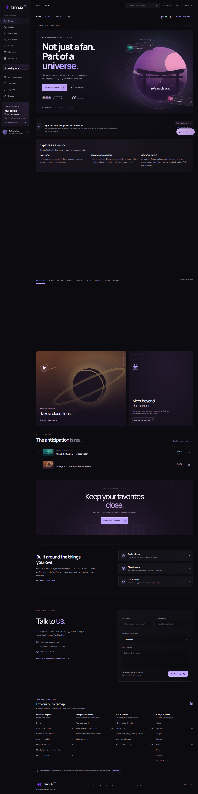

# Fan Hub Plus

[](https://github.com/sobhanabdullah30-a11y/Fan-Hub-Plus/actions/workflows/ci.yml)
[](https://dotnet.microsoft.com/)
[](https://react.dev/)
[](https://vite.dev/)

An immersive, full-stack fandom discovery platform for stories, characters, media, events and community contributions. Fan Hub Plus pairs an accessible React experience with a layered ASP.NET Core API, SQL Server persistence, secure JWT sessions and role-based moderation.

**[Open the live application](https://tech360-fanhub.runasp.net/)** · **[Read the user guide](docs/USER-GUIDE.md)** · **[Review the architecture](docs/ARCHITECTURE.md)** · **[Deployment guide](docs/DEPLOYMENT.md)**



## Highlights

- Eight fandom universes with rich catalog search, filters and editorial discovery.
- Articles, characters, video, audio, galleries, merchandise, releases and events.
- Verified member accounts, bookmarks, private notes, ratings and moderated submissions.
- Administrator workspaces for content, categories, users, feedback, FAQs and analytics.
- Responsive dark interface with theme, accent, larger-text and reduced-motion preferences.
- Layered .NET 8 architecture, SQL Server, EF Core, JWT security and automated CI checks.

## Technology

| Layer | Stack |
| --- | --- |
| Frontend | React 19, Vite 6, Lucide React, responsive CSS |
| API | ASP.NET Core 8, REST, Swagger/OpenAPI, JWT bearer authentication |
| Application | DTOs, validation, AutoMapper, repository and service contracts |
| Persistence | Entity Framework Core 8 and SQL Server |
| Quality | Custom contract/integration runner, ESLint, Prettier and GitHub Actions |

> The hosted demo and deployment environment are separate from the repository. Production secrets are never stored in source control.

The .NET 8 backend implements the supplied SRS with a production-oriented layered design.

The current editorial library contains 60 database-backed content entries, 18 published FAQs, original illustrations and locally hosted narrated media. See [catalog edition and publishing instructions](docs/CATALOG-EDITION.md). The old demo importer is historical; use `scripts/Publish-Catalog.mjs` for this edition.

## Four-layer reference architecture

The project follows the supplied E-Project layout. See [architecture](docs/ARCHITECTURE.md) and [reference comparison](docs/REFERENCE_ALIGNMENT.md).

- Domain: entities, EF Core DbContext/configurations, schema rules, seeds and migrations.
- Application: DTO classes, AutoMapper profiles, repository/service interfaces and shared validation.
- Infrastructure: feature repositories/services, persistence execution, JWT generation, password hashing and email delivery.
- Fan-Hub: controllers, JWT bearer/CORS configuration, middleware, Program.cs and appsettings.
- FanHub.Tests: verification project outside the four runtime layers.

Project references point API -> Infrastructure -> Application -> Domain. Domain intentionally contains EF Core to match the supplied project.

## Setup

1. Build: `dotnet build Fan-Hub.slnx`. A recent SDK supports the existing .slnx format; individual .csproj files also build directly. Projects target net8.0.
2. SQL Server is the current database assumption. Set the real connection through user secrets: `dotnet user-secrets set "ConnectionStrings:DefaultConnection" "YOUR_CONNECTION_STRING" --project Fan-Hub`. Environment alternative: `ConnectionStrings__DefaultConnection`. The committed value is intentionally blank.
3. Create an empty SQL Server database and execute `database/001-initial.sql` in SSMS. This initial schema includes foreign keys, unique indexes, rowversion columns, a rating constraint and eight category seeds. It is not a repeatable migration; do not run it against an existing populated schema. JSON filters require SQL Server compatibility level 130+.
4. Set `BootstrapAdmin:Email` and `BootstrapAdmin:Password` in user secrets (12-128 character password), then run `dotnet run --project Fan-Hub -- --bootstrap-admin`. Remove both bootstrap secrets afterwards. Bootstrap refuses when an administrator exists. There is no default administrator password.
5. Start: `dotnet run --project Fan-Hub`. Use the displayed development URL and open `/swagger`.
6. Tests: `dotnet run --project FanHub.Tests`.

Without a connection string, Swagger and `/health/live` work; `/api/*` and `/health/ready` return 503 with a setup message. Startup never silently substitutes in-memory storage or changes the database schema.

Regenerate initial SQL by running `dotnet run -- --write-schema` from the Fan-Hub API project directory. For a deployed database, author a reviewed incremental migration instead of rerunning the initial script.

## Authentication and configuration

Register -> verify email -> login. Login returns a signed JWT accessToken and expiresAt. Send `Authorization: Bearer <accessToken>`; Swagger provides an Authorize button. JWTs and their stored sessions expire after eight hours by default, configurable through Jwt:ExpiryInMinutes. Logout, password changes/resets and access changes revoke sessions. SQL stores token hashes; passwords use ASP.NET Core PasswordHasher. Verification tokens expire after 24 hours; reset tokens after 30 minutes. Both are single-use.

Development emails are .eml files in `Fan-Hub/App_Data/mail/`, outside the web root and gitignored. Open the link locally, then submit its token to the corresponding POST endpoint. This is a development pickup adapter, not real inbox delivery. Production requires Email:Host, Port, Username, Password, From and an HTTPS Email:FrontendUrl; keep credentials in environment variables/secrets. SMTP uses TLS. Frontend /verify-email and /reset-password pages must call this API using the emailed token.

Configure Cors:Origins for the frontend. Rate limits use the direct peer IP; configure trusted reverse proxies deliberately before using forwarded IP headers. General requests are limited to 120/minute/IP; account routes to 15/15 minutes/IP.

## Endpoint map

All routes start with /api. Swagger lists exact request/response schemas. Enums use names such as Article, Video, Bug, Published, Member and Admin; numeric enum values are rejected in JSON.

| Area | Routes | Access |
| --- | --- | --- |
| Account | POST auth/register, login, verify-email, resend-verification, forgot-password, reset-password | Public |
| Sessions | POST auth/logout, change-password | Member |
| Profile/dashboard | GET/PUT me; GET me/dashboard, me/activity | Member |
| Categories | GET categories; POST admin/categories; PUT/DELETE admin/categories/{id} | Public read/admin write |
| Catalog | GET content, content/filters, content/{id}; POST content/{id}/views; GET content/{id}/share | Public |
| Content types | GET explore/articles, characters, videos, audio, galleries, merchandise, upcoming | Public |
| Events | GET events, events/{id}; GET events/{id}/calendar | Public |
| Ratings | GET content/{id}/ratings; PUT/DELETE content/{id}/rating | Public read/member write |
| Bookmarks/notes | GET me/bookmarks; PUT/DELETE me/bookmarks/{contentId} | Owner |
| Submissions | GET/POST me/submissions; GET/PUT/DELETE me/submissions/{id} | Owner |
| Content admin | GET/POST admin/content; GET/PUT/DELETE admin/content/{id}; PUT admin/content/{id}/moderation | Admin |
| Feedback | GET/POST me/feedback; GET/POST admin/feedback; GET/PUT/DELETE admin/feedback/{id} | Owner/admin |
| User management | GET admin/users, admin/users/{id}; PUT admin/users/{id}/access | Admin |
| Analytics | GET admin/analytics | Admin |
| FAQ knowledge base | GET assistant/faqs; GET/POST admin/faqs; PUT/DELETE admin/faqs/{id} | Public read/admin write |
| FAQ assistant | POST/GET assistant/messages; DELETE assistant/conversations/{id} | Owner |

Content supports Article, Character, Video, Audio, Image, Merchandise, Release and Event. Body stores article/biography text, imageUrls stores galleries, mediaUrl stores video/audio embeds, and tags supports labels such as Limited Edition or Pre-Order. All types share real bookmark/moderation foreign keys. Merchandise is display-only; there are no checkout/payment/order endpoints.

Filters: search, categoryId, fandom, genre, tag, releaseYear, type, minPopularity, featured, sort=latest|popular|alphabetical, page and pageSize (maximum 100). Popularity is recorded views, not unique visitor counting.

Events accept city, from/to, latitude/longitude and radiusKm (1-500). Nearby filtering uses SQL great-circle distance. Omitted from excludes past events. User GPS coordinates are used for querying, not persisted. Calendar exports use UTC, escaped and folded iCalendar. Ticket links are outbound links only.

Admin content is published immediately; member submissions and member edits require approval. Public discovery/detail/bookmarks exclude unpublished content. Member-owned resources use the authenticated ID, never an arbitrary ID from the client.

## Frontend and optional boundaries

This is a backend implementation. Responsive UI, maps/GPS permission, players, breadcrumbs, loading states and theme rendering belong to the frontend. Theme/font-size/fandom preferences are persisted. Sanitize rich text before rendering and restrict iframe origins. The API stores text and HTTPS links without fetching or executing them.

Avatar URLs are supported. Optional binary avatar/media upload is not implemented. The assistant uses published FAQs and private stored history, with an optional Gemini integration when `Gemini:ApiKey` is configured. The deterministic FAQ fallback works without AI credentials.

## Verification limits

Tests cover recovery/revocation, token replay, moderation and ownership, bookmark isolation, rating upserts, event distances, chat ownership, actual MVC role authorization/validation, calendar output, SQL schema and query translation. They do not connect to SQL Server. Live persistence, actual SMTP delivery and database performance remain to be verified after connection/configuration is supplied.

Implementation assistance: OpenAI Codex. Review and understand the implementation before academic submission.

If NuGet vulnerability audit is unavailable on your network, a local verification build can use `dotnet build Fan-Hub.slnx -p:NuGetAudit=false --ignore-failed-sources --disable-build-servers`. This only skips audit for that invocation. Run the normal audited build when network access is restored.

## Requirements and coding conventions

See [backend requirements coverage](docs/BACKEND_REQUIREMENTS.md) for SRS-to-route mapping, optional-feature boundaries and the folder structure. Each entity, enum, DTO, interface and controller lives in a separate file. Namespaces match their folders; HTTP routes are retained. `.editorconfig` defines the formatting convention.

## Optional real SQL regression run

Set `FANHUB_TEST_SQL` in the test process environment to a SQL Server connection with permission to create a database, then run `dotnet run --project FanHub.Tests`. Keep credentials out of committed files. The runner ignores the configured database name and uses a unique `FanHubTests_<guid>` database. It verifies seeding, persistence across contexts, JSON tag filtering, concurrency and cascading deletion, then deletes only the database it created. Without this variable, the runner explicitly reports the live SQL checks as skipped.

For restricted environments, a sequential cached build can use `dotnet build FanHub.Tests/FanHub.Tests.csproj --no-restore -m:1 -p:UseSharedCompilation=false -nodeReuse:false`. This does not restore packages or run a fresh vulnerability audit.

## JWT setup

Configure `Jwt:Key` through user secrets or `Jwt__Key` in the process environment, using a securely generated key of at least 32 UTF-8 bytes. Configure `Jwt:Issuer`, `Jwt:Audience` and `Jwt:ExpiryInMinutes` as needed. Production startup rejects missing/invalid JWT configuration. Development uses an ephemeral key when none is configured; login again after a restart, or configure a stable development secret. Previous opaque access tokens must be replaced by logging in again after this upgrade.

Swagger's Bearer authorization now accepts JWTs. A valid signature alone does not bypass a revoked session or disabled account. `Cors:Origins` controls the named Frontend CORS policy.

## EF migrations

Migrations live in `FanHub.Domain/Migrations`. To create an empty database, configure `ConnectionStrings__DefaultConnection` for the EF command and run:

```text
dotnet ef database update --project FanHub.Domain --startup-project Fan-Hub
```

Use either this migration path or the initial SQL script for a new database. For an existing SQL-script-created database, establish a reviewed migration baseline first; do not run the initial create migration against existing tables. No migrations are run automatically by the application.

AutoMapper 16.2.0 follows the reference project. Supply your AutoMapper license through `AutoMapper:LicenseKey` when configuring your environment.
