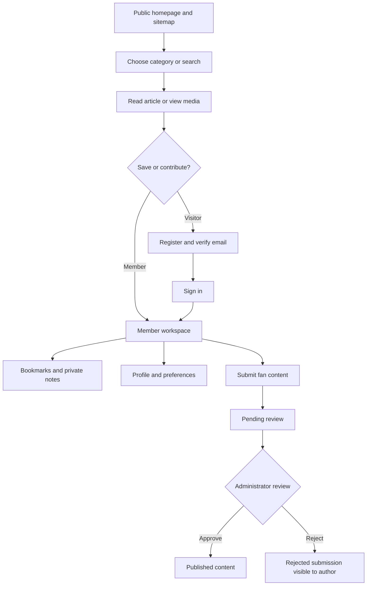
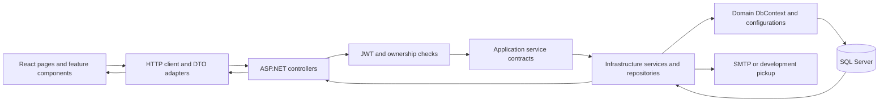
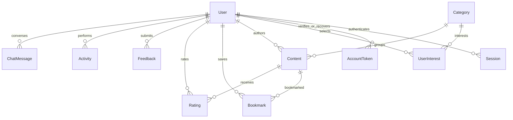

# Access and application flows

| Capability | Visitor | Registered member | Administrator |
|---|---|---|---|
| Home, categories, search and public content | Yes | Yes | Yes |
| Media, events, calendar, map and showcase | Yes | Yes | Yes |
| About, resources, help and sitemap | Yes | Yes | Yes |
| Personal dashboard and profile preferences | Sign in required | Own account | Own account |
| Bookmarks and private notes | Sign in required | Own records | Own records |
| Media ratings and feedback | Sign in required | Yes | Yes |
| Fan submissions | Sign in required | Pending review | Can publish directly |
| Content and category management | No | No | Yes |
| User access, moderation, feedback replies and analytics | No | No | Yes |
| FAQ management | No | No | Yes |

The sidebar separates public browsing, Member Space and Administration. Guests see sign-in and registration calls to action instead of private navigation. The homepage describes all three access levels. A direct visit to a private route shows a sign-in requirement; a member visiting the admin route sees an access-denied explanation. Backend authorization and ownership checks enforce these rules independently of the UI.

## Visitor and member flow

## Request and data flow

Domain's EF configuration placement follows the supplied reference project's four-layer convention. It is not a framework-independent domain model.

## Database relationships

Content types share one aggregate so moderation, ratings and bookmarks use consistent foreign keys. Categories and user interests provide the many-to-many relationship. FAQ entries are managed independently; stored chat responses preserve conversation history.
